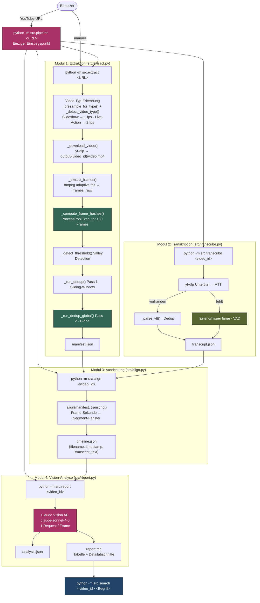
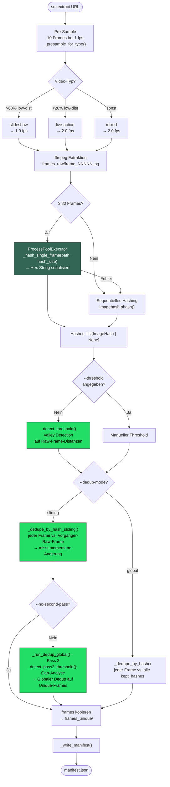
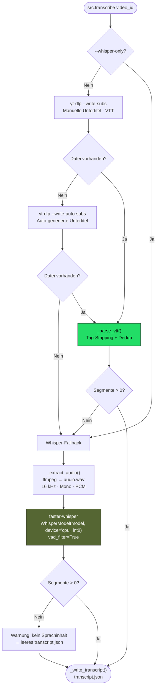
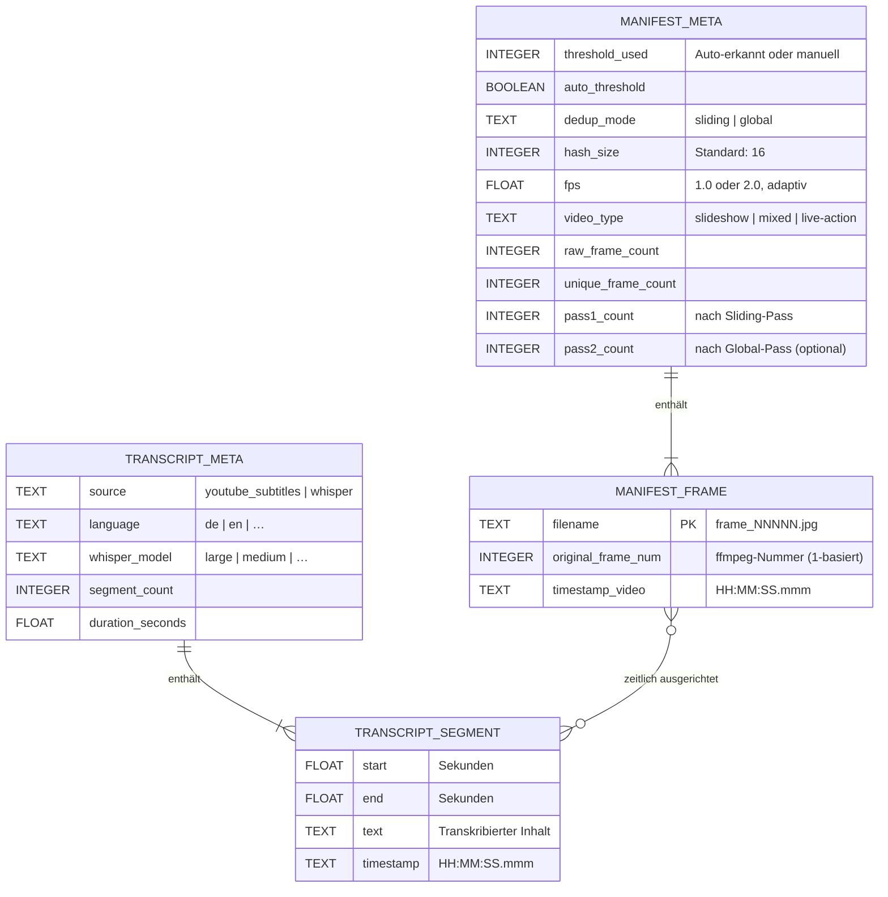
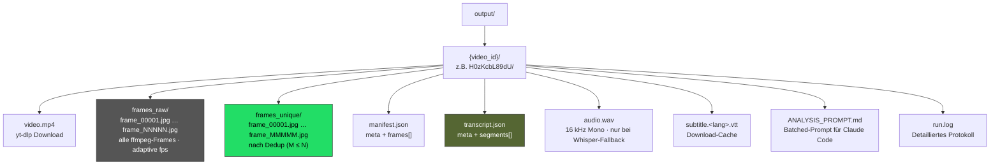
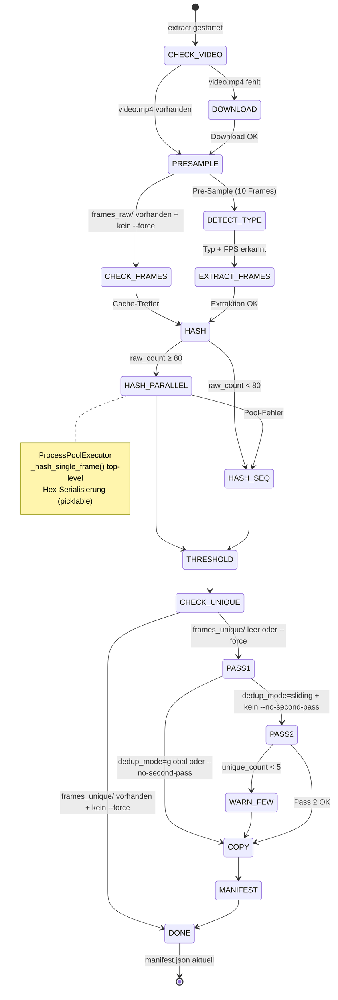
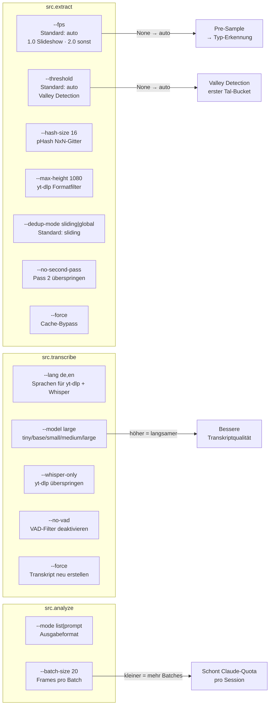

# frame-sift — Architektur

## Gesamtpipeline

## Extraktion: Detaillierter Ablauf

## Transkription: Fallback-Strategie

## Datenmodell

## Output-Verzeichnisstruktur (pro Video)

## Cache-Verhalten (Idempotenz)

## Konfigurationsparameter

