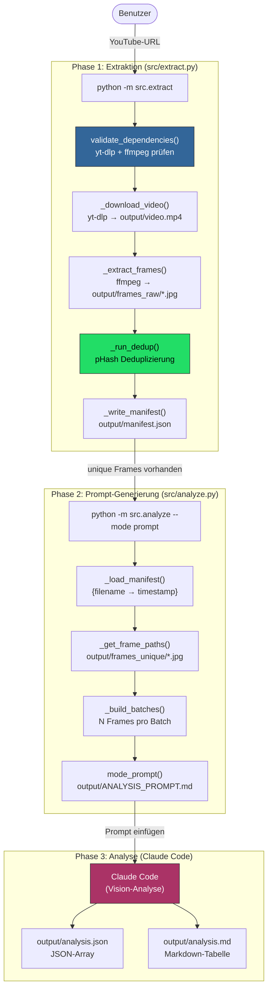
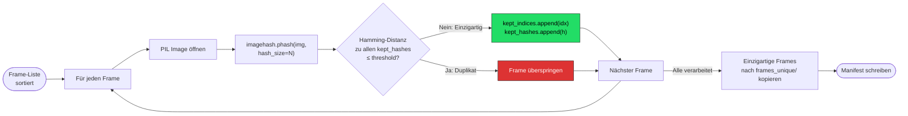
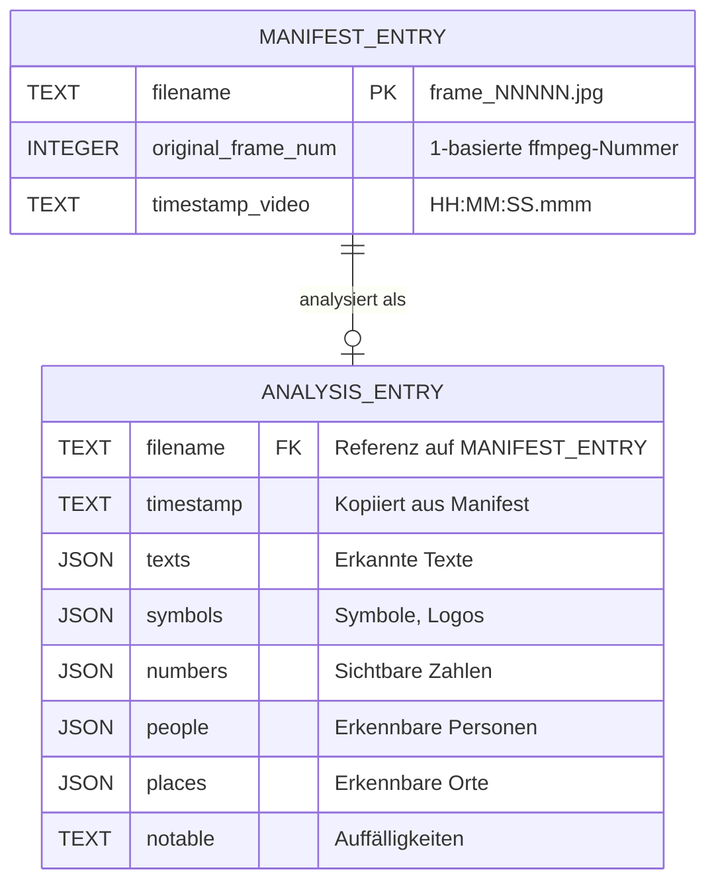
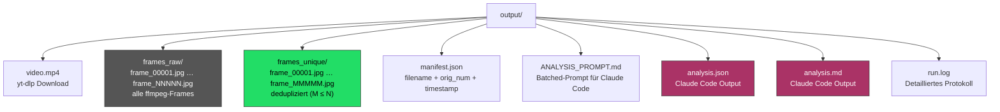
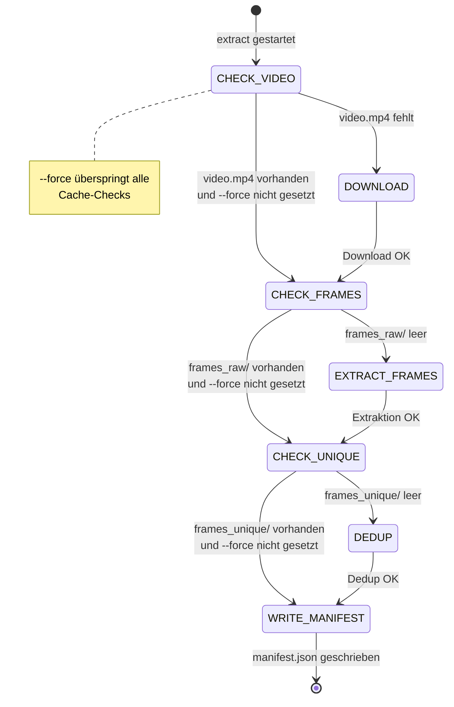
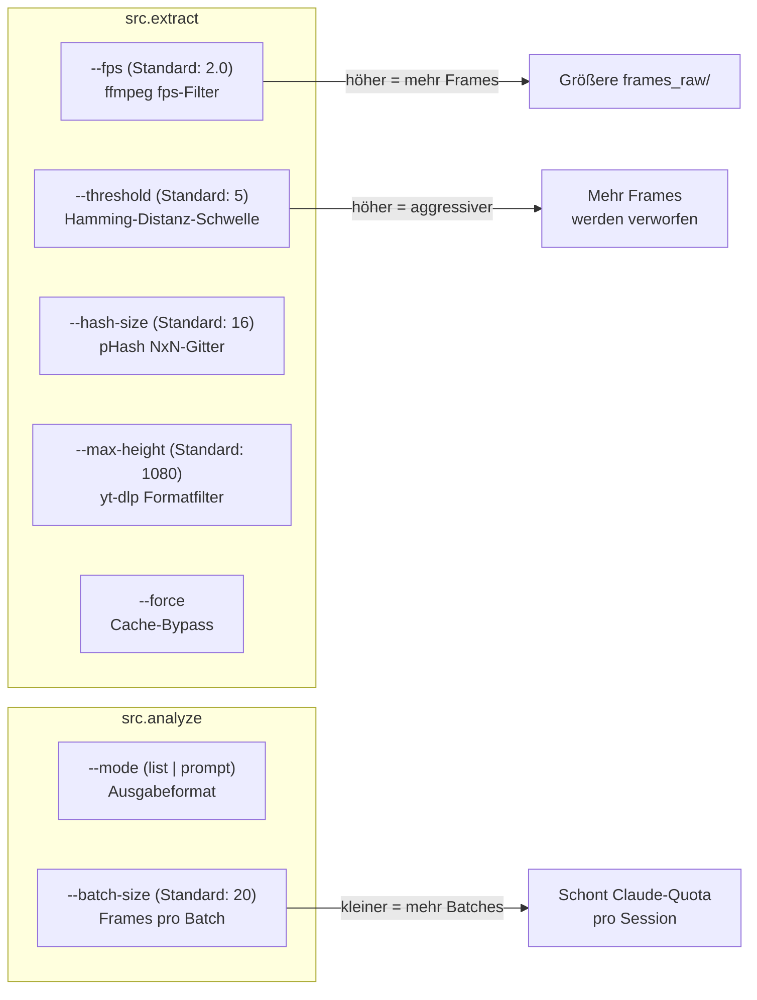

# frame-sift — Architektur

## Gesamtpipeline

## Deduplizierungs-Algorithmus (Perceptual Hash)

## Datenmodell (manifest.json)

## Output-Verzeichnisstruktur

## Cache-Verhalten (Idempotenz)

## Konfigurationsparameter

